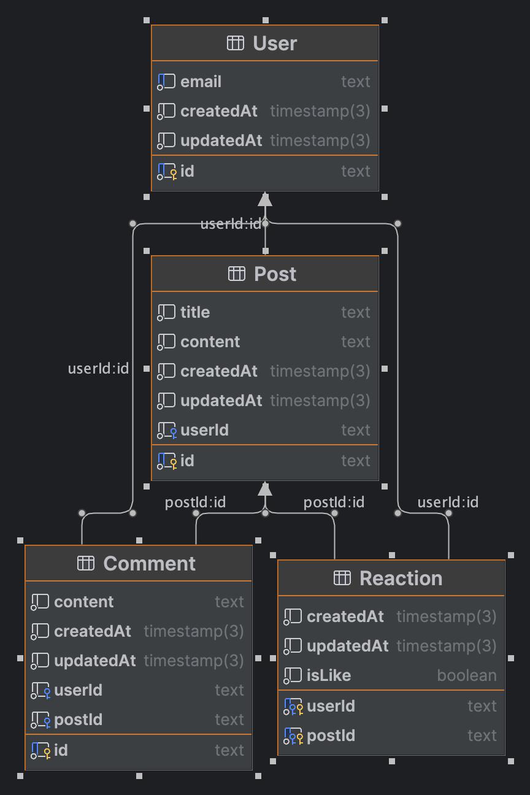

# eco-backend

## Database

The database is a PostgreSQL or Mysql database. The goal is to compare the performance on different type of load.

## Language and Framework

- Python - Django - django-orm
- Node.js - Express - prisma
- PHP - Laravel - Eloquent
- Java - Spring - Hibernate
- go - gorm
- C# - .NET Core - nttframework
- Rust - Actix - diesel

## Data to be measured

- Power consumption
- CPU usage
- Memory usage
- Iteration number
- Time to first byte

## Variations

For each language and framework, we will test the following variations:

- Database used
- Scenario (All round, read heavy, write heavy)
- OS if time permits

## Scenario

- All round: 50% read, 50% write

  - A user create an account
  - This user create some posts 100
  - This user read some posts 100
  - This user like some posts 50
  - This user comment some posts 50 (10 comments per post)
  - This user read some posts comments 50

- Read heavy: 90% read, 10% write

  - User create an account
  - User read some posts 100
  - User read some posts comments 50
  - User like some posts 25
  - User read some posts 100

- Write heavy: 10% read, 90% write
  - User create an account
  - User create some posts 100
  - User comment some posts 50 (10 comments per post)
  - User like some posts 50
  - User create some posts 100
  - User comment some posts 50 (10 comments per post)
  - User like some posts 50
